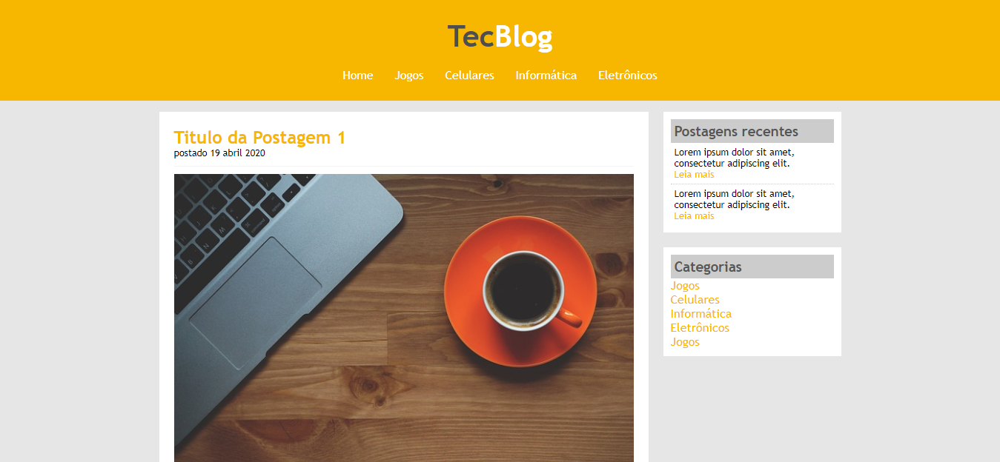

## 💻 Projeto Tecno Blog

<h1 align="center">
    
</h1>

Projeto realizado no curso Desenvolvimento Web Completo 2021 - 20 cursos + 20 projetos

O projeto não está responsivo, pois objetivo principal era o estudo de float.

## 🛠 Tecnologias

- HTML
- CSS
